# Desarrollador Backend y Lógica PHP (S2, S3, S4)

En este apartado se detalla la implementación del Bloque 3 del Sprint 2 por donde se despliegan los contenedores S2, S3 y S4 en la Instancia 2 utilizando Apache \+ PHP 8.3. Se adaptan los scripts extagram.php y upload.php del Sprint 1 para conectarse a la base de datos MySQL S7 y utilizar el volumen compartido \~/app/statics/img/uploads/ con el contenedor S5. Los contenedores S2/S3 proporcionan redundancia para mostrar el feed de publicaciones mientras S4 procesa las subidas de imágenes, garantizando persistencia tanto en el sistema de archivos como en la base de datos remota.

# 1\. Verificar estructura actual y versiones Docker

En este apartado verificaremos la estructura del projecto que esta montado dentro del directorio app i verificaremos las versiones de docker i docker-compose instalados previamente.

Una vez conectados a la estancia dos haremos ls y no meteremos en el directorio app.  
En este directorio ira los archivos necesarios para que la web funcione.

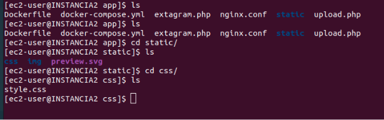  
Si entramos en el directorio img veremos el directorio uploads donde se guardaran las imagenes qeu se suban desde la web.

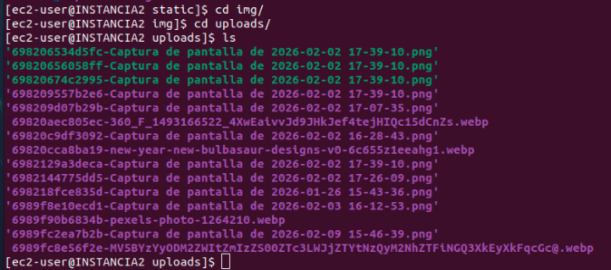  
Para verificar que docker y docker-compose estan instalados correctamente y saber su version utilizaremos las siguientes comandas.
```bash
docker compose version
docker \--version
```

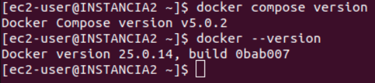 

# 2.Creación de scripts PHP dinámicos (extagram.php y upload.php)

En el Paso 2 se crean desde cero los scripts PHP dinámicos extagram.php y upload.php adaptados del Sprint 1 a la arquitectura distribuida. extagram.php implementa el formulario de subida (dirigido a S4) y el listado de publicaciones desde la base de datos MySQL S7, utilizando CSS de S6 e imágenes de S5 /uploads/. Los contenedores S2/S3 proveen redundancia para esta funcionalidad conectándose a la DB remota y al volumen compartido de imágenes.

## 2.1 extagrma.php

En este sprint se ha utilizado el mismo codigo base de extragram, pero se ha tenido que adaptar para qeu funcione con los conetenedor y tenga connexion con las otras estancias.

En este archivo se encuntra la base de la web, es la cara visible del projecto qeu ira ligada a upload y style para completar “app”.
´´´bash
sudo nano extagram.php  
```
codigo actual:

```bash
\<\!DOCTYPE html\>  
\<html lang="es"\>  
\<head\>  
    \<meta charset="UTF-8"\>  
    \<title\>Extagram\</title\>  
    \<link href="https://fonts.googleapis.com/css2?family=Inter:wght@400;600;700\&display=swap" rel="stylesheet"\> 
    \<link rel="stylesheet" href="/css/style.css"\>  
\</head\>  
\<body\>  
    \<nav class="navbar"\>\<div class="nav-content"\>Extagram\</div\>\</nav\>  
    \<div class="container"\>  
        \<div class="upload-card"\> 
            \<h3\>Crear publicación\</h3\>  
            \<form id="uploadForm" method="POST" enctype="multipart/form-data" action="/upload.php"\> 
                \<input type="text" name="title" placeholder="Título" required\> 
                \<input type="text" name="description" placeholder="Descripción"\>

                \<div class="drop-zone" id="drop-zone"\>  
                    \  
                    \<p id="drop-text"\>Arrastra tu foto aquí o haz clic\</p\>  
                    \<input type="file" name="photo" id="file-input" required hidden accept="image/\"\> 
                \</div\>  
                \<input type="submit" value="Compartir Foto"\>  
            \</form\>  
        \</div\>

        \<?php  
        $db \= new mysqli("172.31.67.233", "extauser", "extapass", "extagram");  
        if (\!$db-\>connect\_error) {  
            $result \= $db-\>query("SELECT \ FROM posts ORDER BY created\_at DESC");  
            while ($fila \= $result-\>fetch\_assoc()) {  
                echo "\<div class='post-card'\>";  
                echo "\<div class='post-header'\>"; 
                echo "\<div class='avatar'\>\</div\>";  
                echo "\<span class='username'\>Usuario\</span\>";  
                echo "\</div\>"; 
                  
                if ($fila\['image'\]) {  
                    echo "\";  
                }  
                  
                echo "\<div class='post-footer'\>"; 
                echo "\<span class='post-title-text'\>" . htmlspecialchars($fila\['title'\]) . "\</span\>";  
                echo "\<p class='post-description'\>" . htmlspecialchars($fila\['description'\]) . "\</p\>"; 
                echo "\</div\>";  
                echo "\</div\>";  
            }  
            $db-\>close();  
        }  
        ?\> 
    \</div\>

    \<script\>  
        const dropZone \= document.getElementById('drop-zone'); 
        const fileInput \= document.getElementById('file-input');  
        const preview \= document.getElementById('preview');  
        const dropText \= document.getElementById('drop-text');

        // Manejo de eventos de arrastre 
        \['dragenter', 'dragover', 'dragleave', 'drop'\].forEach(name \=\> { 
            window.addEventListener(name, e \=\> { e.preventDefault(); e.stopPropagation(); }, false);  
            dropZone.addEventListener(name, e \=\> { e.preventDefault(); e.stopPropagation(); }, false); 
        });

        dropZone.addEventListener('dragover', () \=\> dropZone.classList.add('drag-over'));  
        \['dragleave', 'drop'\].forEach(name \=\> dropZone.addEventListener(name, () \=\> dropZone.classList.remove('drag-over')));

        dropZone.onclick \= () \=\> fileInput.click();  
        fileInput.onchange \= () \=\> handleFiles(fileInput.files);

        dropZone.addEventListener('drop', e \=\> {  
            const files \= e.dataTransfer.files;  
            if (files.length \> 0\) {  
                fileInput.files \= files;   
                handleFiles(files);  
            }  
        });

        function handleFiles(files) {  
            const file \= files\[0\];  
            if (file && file.type.startsWith('image/')) {  
                const reader \= new FileReader();  
                reader.onload \= e \=\> {  
                    preview.src \= e.target.result;  
                    dropText.innerText \= "Imagen lista: " \+ file.name;  
                };  
                reader.readAsDataURL(file);  
            }  
        }  
    \</script\>  
\</body\>  
\</html\>
```
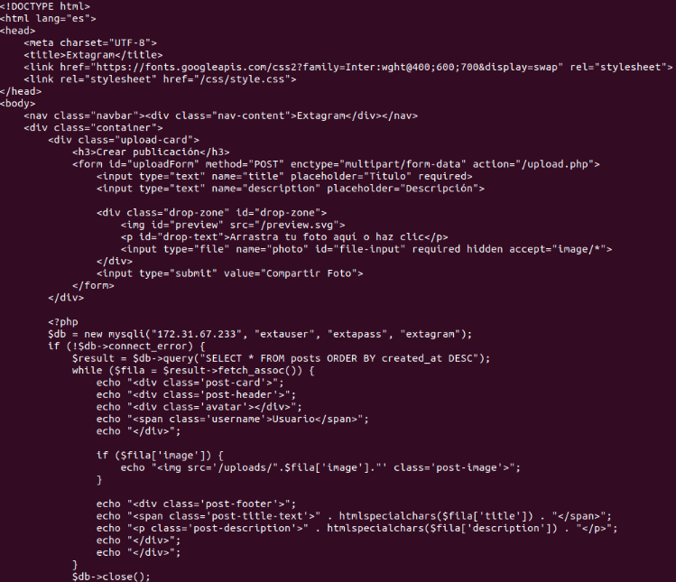   
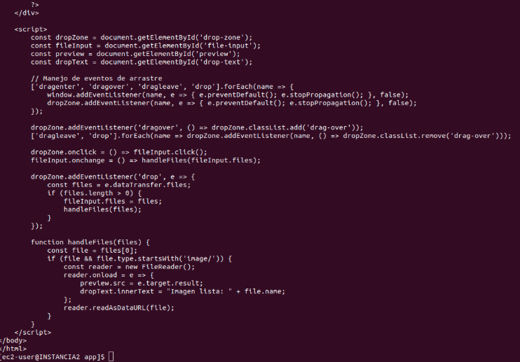 

## 2.2 Upload.php  
Con el archivo upload.php se ha hecho algo parecido, se ha adaptado el archivo anterior para que tenga redundancia con los contenedores, con los otros sistemas y estancias.

Codigo actual: 
```bash
sudo nano upload.php
```

```bash

\<?php  
if ($\_SERVER\['REQUEST\_METHOD'\] \== 'POST') {  
    $title \= $\_POST\['title'\];  
    $description \= $\_POST\['description'\];

    if (\!empty($\_FILES\['photo'\]\['name'\])) {  
        $image\_name \= uniqid() . "-" . basename($\_FILES\['photo'\]\['name'\]);  
        // Ruta correcta para el contenedor S4  
        $target\_path \= 'uploads/' . $image\_name;

        if (move\_uploaded\_file($\_FILES\['photo'\]\['tmp\_name'\], $target\_path)) {  
            $image\_blob \= file\_get\_contents($target\_path);

            $db \= new mysqli("172.31.67.233", "extauser", "extapass", "extagram");

            if ($db-\>connect\_error) { die("Error: " . $db-\>connect\_error); }

          tu DB)  
            $stmt \= $db-\>prepare("INSERT INTO posts (title, image, description, image\_blob, created\_\>  
            $null \= NULL;  
            $stmt-\>bind\_param("sssb", $title, $image\_name, $description, $null);  
            $stmt-\>send\_long\_data(3, $image\_blob);

            if ($stmt-\>execute()) {  
                header("Location: /extagram.php");  
                exit();  
            } else {  
                echo "Error: " . $stmt-\>error;  
            }  
            $db-\>close();  
        } else {  
            die("Error de permisos en la carpeta uploads.");  
        }  
    }  
}  
?\>
```
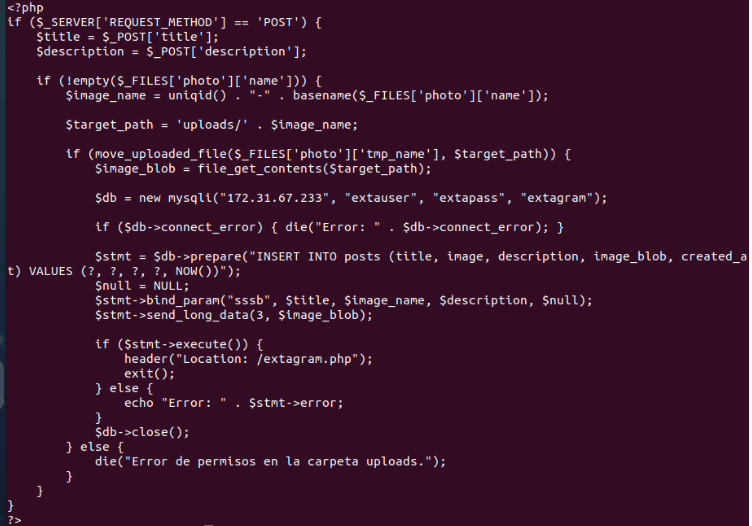 

Verificaciones:
```bash
ls \-la \.php  
grep "172.31.67.233" \.php
```
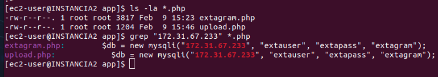 

# 

# 3.Docker-compose.yml

Una vez tenemos la base del projecto hecha toca modificar el directorio docker\_compose donde se crean dentro de el los contenedores.

Los contenedores en este caso sirven para distribuir el trabajo de la web en los direferntes contenedores. Cada contenedor tiene un servicio y esto hace qeu la faena se reparta y que sea menos propenso el colapso. Nos sirve tambien para tener separados servicios qeu no deben ser accesibles.

Al tener ya unos cuantos contenedores creados lo que se hara es añadir los faltantes ( S2, S3, S4). La funcion de cada contenedor es la siguiente:

S2 y S3:  
Muestran la página principal Extagram \- ejecutan extagram.php que enseña el feed de fotos \+ formulario subir foto. Son iguales haciendo que si uno falla el otro responda por él.

S4:  
Procesa las subidas \- recibe formulario de S2/S3, guarda foto en statics/img/uploads/, mete datos en DB, redirige de vuelta a página principal.

Configuración entera de todos los contenedores:
```bash
version: '3.8'

services:  
  \# El "Gateway" (Nginx)  
  nginx\_gateway:  
    image: nginx:alpine  
    container\_name: gateway\_sprint2  
    ports:  
      \- "9002:80"  
      \- "9003:81"  
      \- "9004:82"  
    volumes:  
      \- ./nginx.conf:/etc/nginx/conf.d/default.conf  
      \- ./:/var/www/html  
    restart: unless-stopped

  \# Contenedores PHP con el motor ya construido  
  s2:  
    image: extagram-app-image  
    container\_name: s2\_extagram  
    volumes:  
      \- ./extagram.php:/var/www/html/extagram.php  
    restart: unless-stopped

  s3:  
    image: extagram-app-image  
    container\_name: s3\_extagram  
    volumes:  
      \- ./extagram.php:/var/www/html/extagram.php  
    restart: unless-stopped

  s4:  
    image: extagram-app-image  
    container\_name: s4\_upload  
    volumes:  
      \- ./upload.php:/var/www/html/upload.php  
      \- ./static/img/uploads:/var/www/html/uploads  
    restart: unless-stopped

  \# S5: Servidor de Imágenes (Puerto 8085\)  
  s5\_images:  
    image: httpd:2.4  
    container\_name: s5\_images  
[image1]: 
    ports: \["8085:80"\]  
    \# Mapeamos la carpeta de imágenes para que sean visibles  
    volumes:  
      \- ./static/img:/usr/local/apache2/htdocs:ro  
    restart: unless-stopped

  \# S6: Servidor de Estáticos (Puerto 8086\) para CSS y preview.svg  
  s6\_static:  
    image: httpd:2.4  
    container\_name: s6\_static  
    ports: \["8086:80"\]  
    \# Mapeamos la carpeta static completa  
    volumes:  
      \- ./static:/usr/local/apache2/htdocs:ro  
    restart: unless-stopped
```

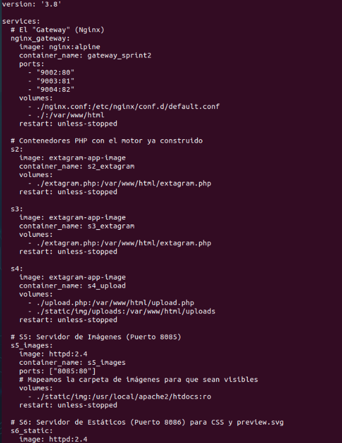   
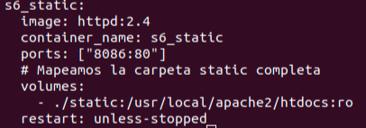 

# 4.Permisos y Despliegue

En este punto esta todo hecho pero para qeu funcione tenemos que darle permisos de escritura a los directorios ya que Apache dentro de docker corre como www-data y necesita persissos para los volumenes compartidos.
```bash
sudo chown \-R 33:33 static/img/uploads  
sudo chmod 775 static/img/uploads  
docker compose down  
docker compose up \-d
```
  
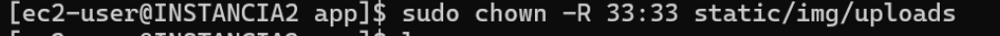  
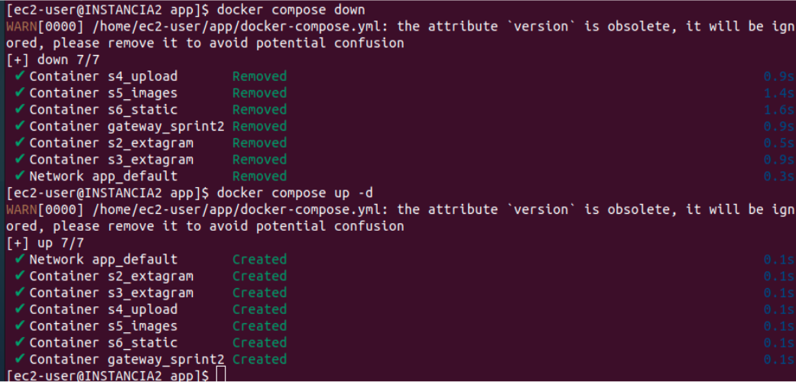  

#  5: Verificaciones

Ahora haremos verificaciones para ver si se han aplicado bien las configuraciones y cambios.
```bash
docker ps
```
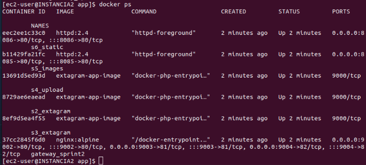  

```bash
curl localhost:8086/css/style.css | head \-3
```  
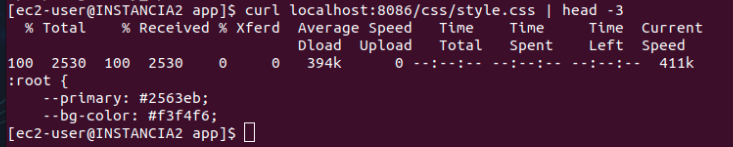  

```bash
curl localhost:9002/extagram.php | grep "post-card"
``` 
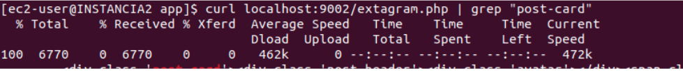  

```bash
curl \-I localhost:9004/upload.php
```  
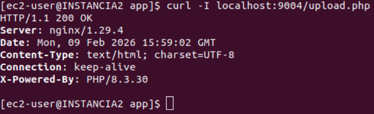  

```bash
curl localhost:8085/uploads/
```
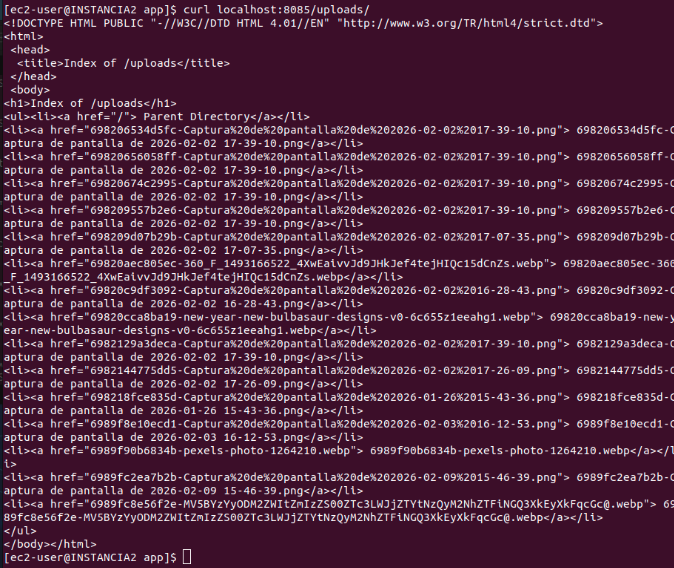  

Puertos expuestos:  
9002 → extagram.php (S2)  
9003 → extagram.php (S3)   
9004 → upload.php (S4)  
8085 → static/img/uploads/ (S5)  
8086 → static/css/ (S6)
