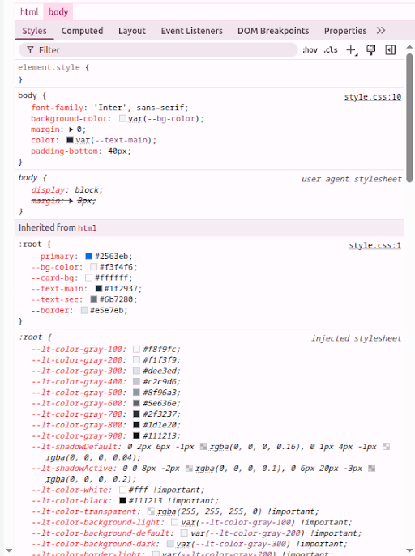
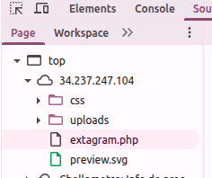
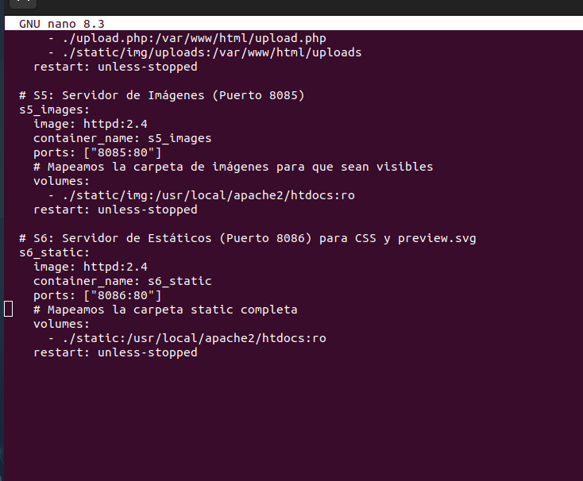
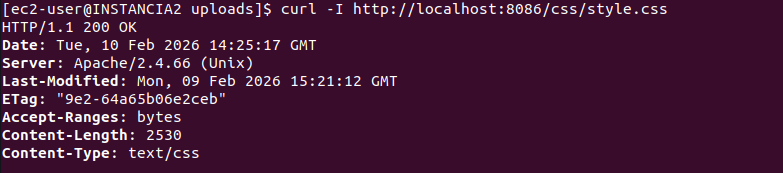

# Proxy Inverso y Servidores Estáticos

## 1. Topología del Sistema
El sistema se divide en tres capas funcionales para optimizar el rendimiento y la disponibilidad:

S1 (Proxy/Balanceador): Punto de entrada único basado en Apache que distribuye el tráfico.

S2 y S3 (Nodos de Cómputo): Servidores que procesan la lógica principal de la aplicación (Extagram Feed).

S5 y S6 (Servidores Estáticos): Contenedores especializados en servir imágenes de usuario y recursos del sistema (CSS, SVG).

## 2. Configuración del Balanceador de Carga (S1)
El contenedor S1 utiliza el módulo mod_proxy_balancer de Apache para segregar el tráfico según la ruta de la URL.

### Definición del Clúster
Se agrupan los nodos de aplicación en un balanceador virtual:

Apache
<Proxy "balancer://mycluster">
    # Nodo S2
    BalancerMember "http://172.31.31.80:90062" 
    # Nodo S3
    BalancerMember "http://172.31.31.80:9003"
</Proxy>

(Nota: Los puertos corresponden a las instancias de la aplicación en ejecución )

### Reglas de Segregación de Rutas
Para optimizar la respuesta, se redirigen peticiones específicas a servidores especializados:

Recurso	Ruta URL	Destino (Servidor)
Subida de archivos	/upload.php	

`http://172.31.31.80:9004/upload.php`

Estáticos del sistema	/css/, /preview.svg	

`http://172.31.31.80:8086/ (S6)` 

  

Imágenes de usuario	/uploads/	

`http://172.31.31.80:8685/uploads/ (S5)` 

Lógica General	/ (Raíz)	

`balancer://mycluster/ (S2/S3)` 

  

## 3. Despliegue de Servidores Estáticos
Se utilizan imágenes ligeras de httpd:2.4 para S5 y S6, mapeando volúmenes locales en modo de solo lectura (ro).

### Configuración de Docker Compose (S5 y S6)

  

## 4. Estructura de Archivos y Verificación
Es crucial que la estructura de directorios en el host coincida con los volúmenes montados para que los recursos sean accesibles.

S5 (Imágenes): Almacena las capturas y archivos .webp subidos por los usuarios en el directorio /uploads.

S6 (Interfaz): Sirve archivos críticos como style.css y preview.svg.

Prueba de Disponibilidad de Activos
Se puede verificar que el servidor S6 responde correctamente mediante un comando curl:

Bash
`curl -I http://localhost:8086/css/style.css`

  

