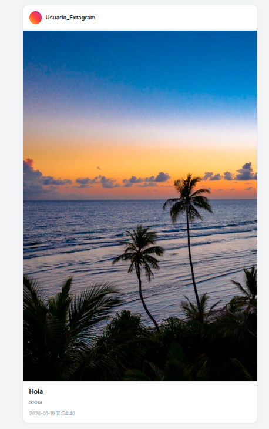

# Subida de imagenes

La web funciona correctamente, como se observa en estas capturas de pantalla adjuntas. Permite crear y visualizar publicaciones con una interfaz similar a la app original.

## Ventana de creación de publicación 

Esta es la interfaz de "Crear publicación" en la misma app.

- Campo para título:"¿Qué título le pones?

- Campo para descripción:"Escribe un pie de foto...".

- Opciones: "Añadir fichero".

- Botón azul principal: "Compartir foto".
​
## Funcionalidad en Publicación 

Muestra una publicación exitosamente cargada.

- Imagen de playa al atardecer con palmeras y mar, renderizada sin problemas.

- Logo "Usuario_Extagram" visible en la esquina superior.

- Contenido: "Hola", fechada en "2026-01-19 15:54:49", confirmando carga dinámica de posts.

