# Hardening Web (WAF)

El **Web Application Firewall (WAF)** es un filtro de **Capa 7 (Aplicación)** que inspecciona el tráfico HTTP. A diferencia del firewall que bloquea puertos, el WAF lee lo que el usuario escribe en la web para detener ataques como Inyección SQL, XSS, Escaneo de Vulnerabilidades.


# 1.Instalación del motor ModSecurity
```bash
sudo apt update 
sudo apt install libnginx-mod-http-modsecurity modsecurity-crs \-y
```
## 1.1.Preparar los archivos de configuración
```bash
sudo mkdir \-p /etc/nginx/modsecurity.d
``` 
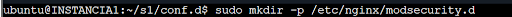
```bash
sudo cp /etc/modsecurity/modsecurity.conf-recommended /etc/nginx/modsecurity.d/modsecurity.conf
```
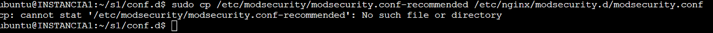

## 1.2.Modo DetectionOnly
```bah
sudo nano /etc/nginx/modsecurity.d/modsecurity.conf
```

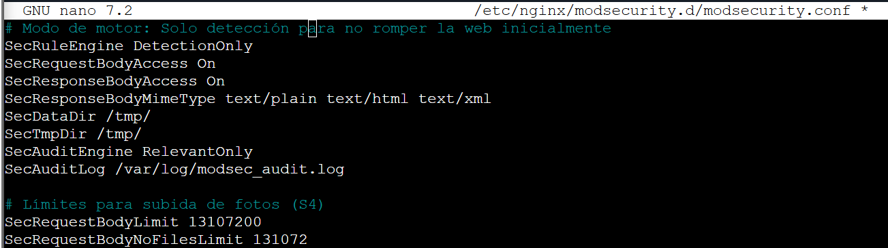

Con **SecAuditEngine on** se podrá ver todos los logs que registra la web, con RelevantOnly sólo si registra algo sospechoso.

Para no romper la web, la línea SecRuleEngine DetectionOnly es la más importante.  
Esto hace que ModSecurity analice los ataques y los guarde en el log, pero deja pasar todo el tráfico. Así puedes verificar que los usuarios pueden seguir subiendo fotos a S4 sin bloqueos por "falsos positivos"

## 1.3.Conectar las reglas de la comunidad
```bash
sudo nano /etc/nginx/modsecurity.d/include.conf  
```
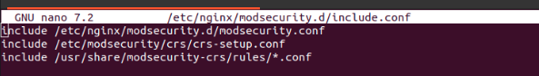

## 1.4.Activar el WAF en el balanceador S1

Dentro de /etc/nginx/sites-available/default \*  modificamos el apartado de server añadiendo las siguientes lineas que lo que hacer es decirle al server que analice todo lo que entre.
```bash
modsecurity on; 
modsecurity\_rules\_file /etc/nginx/modsecurity.d/include.conf;
```
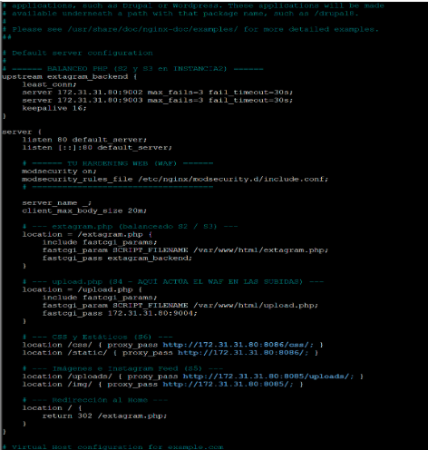 

Ahora hacemos las siguientes comandas para comprobar que todo ha funcionado
```bash
sudo systemctl restart nginx  
sudo systemctl status nginx
```
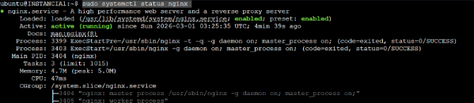

Ahora con la comanda **sudo tail \-f /var/log/modsec\_audit.log** podemos ver los registros (logs) de la web confirmando que la estructura de ModSecurity a funcionado

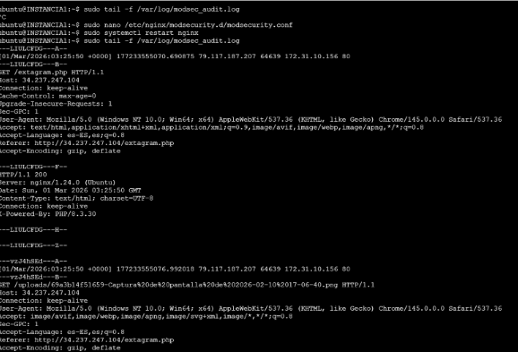

### 1.4.2 Simulación de ataque

Una vez configurado todo podemos comprobar a hacer una simulacion para comprovar que el ModSecurity detecta el ataque. Con la comanda **curl \-k "[https://34.237.247.104/extagram.php?id=-1%20UNION%20SELECT%201,user(),version(),4](https://34.237.247.104/extagram.php?id=-1%20UNION%20SELECT%201,user\(\),version\(\),4)"**, lo que intentamos es robar informacion de la BBDD como es intentar encontrar el nombre de usuario y la version de la BBDD. Si entramos a **sudo tail \-f /var/log/modsec\_audit.log** y ejecutamos la comanda podemos ver como bloquea la petición


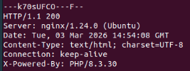 

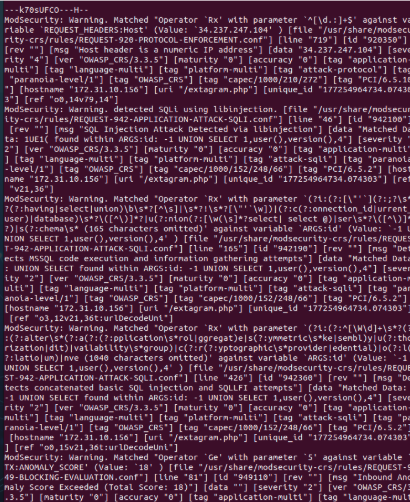

Si hiceramos una peticion normal como subir una imagen se veria asi  
Podemos ver que ha se ha subido la foto correctamente.  

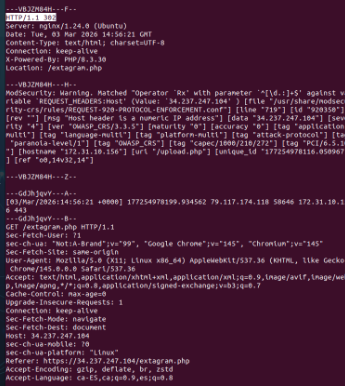

Aqui confirmamos que la imegen esta publicada correctamente  

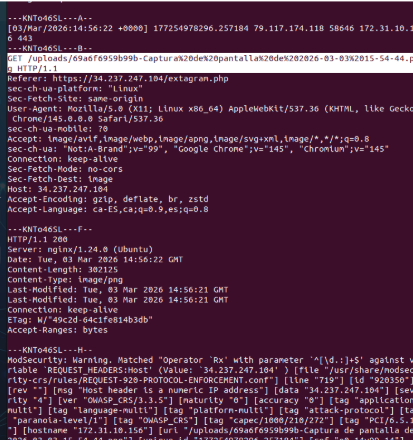

# 2\. Transformar web a HTTPS

## 2.1 Generamos la clave de seguridad

Con la comanda **sudo openssl req \-x509 \-nodes \-days 365 \-newkey rsa:2048 \-keyout /etc/ssl/private/nginx-selfsigned.key \-out /etc/ssl/certs/nginx-selfsigned.crt** generamos la clave.

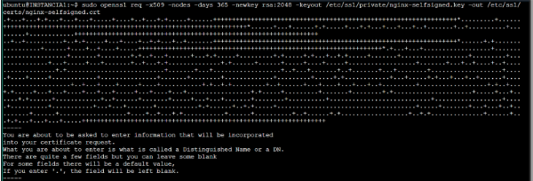

## 2.2 Configurar Nginx

Ahora tenemos que decirle a nginx que utilize la clave. Para poder hacerlo entramos dentro de **sudo nano /etc/nginx/sites-available/default** y modificamos el server para añador la escucha.  

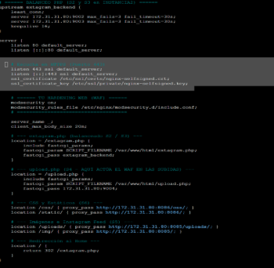
```bash
listen 443 ssl default\_server;  
listen \[::\]:443 ssl default\_server;  
ssl\_certificate /etc/ssl/certs/nginx-selfsigned.crt; 
ssl\_certificate\_key /etc/ssl/private/nginx-selfsigned.key;  
```
Después de hacer los cambios reiniciamos nginx

# 3.Comprobación

Para comprobar que se han aplicado los cambios intentamos entrar en la web https://34.237.247.104/extagram.php

Como podemos ver entramos perfectamente  

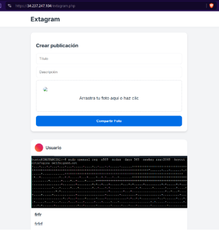

Cuando la página era con http nos aparecia el logo de no segur y ahora no

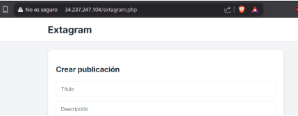


