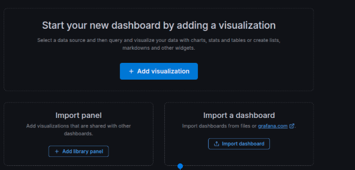
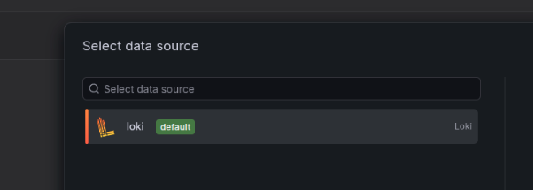
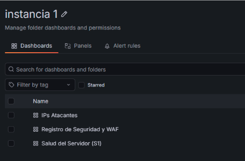
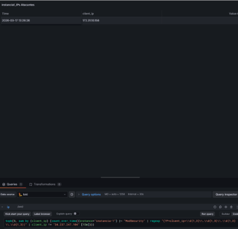
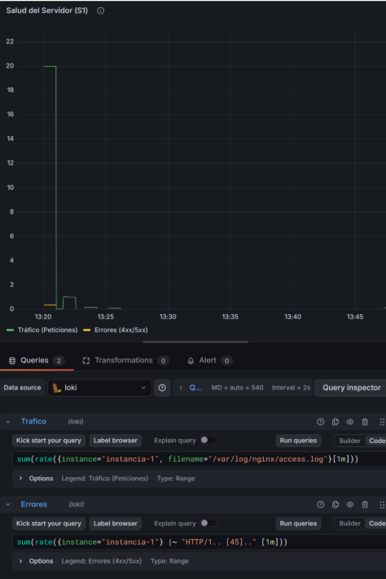
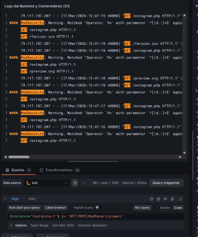
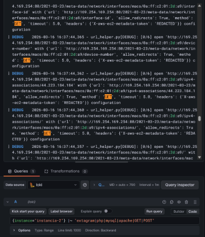

# Dashboards en Grafana

Los Dashboards son el cuadro de mandos de la web en ellos podemos ver lo que pasa en cada momento con los diferentes dashboards que se han creado. Nos enseñan de un vistazo lo que está pasando en la web.

Se han dividido en 2 folders. Intancia 1 e intancia 2\.

# 

## 1.0.Instancia 1

En el he creado estos diferentes dashboard que dan diferente información.

### 1.1 IP atacantes 

Salen las ip que más se connectando y  que pueden ser posibles ataques

`topk(5, sum by (client_ip) (count_over_time({instance="instancia-1"} |~ "ModSecurity" | regexp "(?P<client_ip>\\d{1,3}\\.\\d{1,3}\\.\\d{1,3}\\.\\d{1,3})" | client_ip != "34.237.247.104" [15m])))`

### 1.2 Salud del servidor (1)

Sirve para saber si tus contenedores están vivos o si la máquina se está quedando sin memoria y posibles errores de carga de la web  

`sum(rate({instance="instancia-1", filename="/var/log/nginx/access.log"}[1m]))`

`sum(rate({instance="instancia-1"} |~ "HTTP/1.. [45].." [1m]))`

### 1.3 Registro de Seguridad y WAF

Son alertas de seguridad, esto permite saber si una ip esta siendo bloqueada por las reglas WAF

# 

## 2.0.Instancia 2

En este dashboard lo que hacemos es mirar si las el backend está actuando correctamentente o hay algún problema con los diferentes servicios

`{instance="instancia-2"} |~ "extagram|php|mysql|apache|GET|POST"`  

C9yQiw4kuT9Fob0ZfIk26eCIAi3ChdMF9zu/wGPkY8GjSs/IAAAAABJRU5ErkJggg==>
